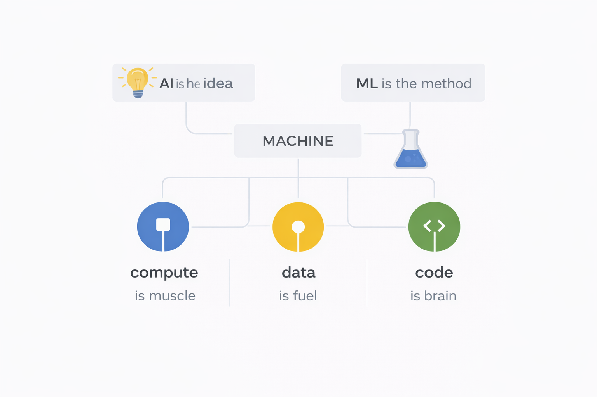

# Topic 0 - AI vs ML

AI and ML are not just some smart computer things.  
They are part of a bigger pool of concepts called **AI, ML, Deep Learning, NLP, and more.**  
In essence, we can think of it as →

--- 

## What AI actually is →

AI is not a technology, but a **goal**.  
Its purpose, in very basic terms, is to make machines behave in a way that looks intelligent to humans.

AI has existed before ML.  
Even simple if–else statements come under AI.

For example →  
A calculator is a very basic form of AI.  
A vacuum cleaner that changes direction when it hits a wall is AI.

It knows which direction is correct.  
It can automatically traverse through the place.

Thus, **not much human intervention was needed**, and it’s doing “AI”.

---

## What ML actually is →

Originally, AI had pre-written instructions and fixed algorithms.  
But the intelligence came just from following that algorithm.

So, ML is a way to build AI **without writing rules manually**.

In essence, it’s like training a machine to learn.

You give it:
- a huge number of examples  
- correct outcomes  
- rewards  
- punishments  

And it slowly learns what behaviour is rewarding and what isn’t.

So by exposure to actual learning, it learns from its mistakes and adapts, similar to humans.

---

## How they connect together →

Modern AI = ML powered AI

That is why when people say AI, what they actually mean is **ML systems**.

AI is the destination.  
ML is the road we take to get there.

---

## Why AI and ML are used together →

ML got very good.  
Deep learning happened.  
Data exploded.  
Compute became cheap.

Suddenly, ML became the dominant way to do AI.

Language, speech, images - everything started being solved using ML.

So in a way, **90% of AI we see today = ML under the hood.**

---

## Why this is trending now →

AI and ML used to be separate. But then:

- ML got very powerful  
- Deep learning happened  
- Data exploded  
- Compute became cheap  

So ML solved the main problems of AI - language, speech, vision.

That’s why now AI feels like it suddenly appeared everywhere.

---

## Why non-tech people should understand this →

AI is not magic.  
It is not a living entity.  
It is not thinking.

AI is a system trained on data, learning patterns, and predicting outcomes.

Understanding this makes you:
- less scared
- less misled
- more in control
- more aware

AI literacy is becoming as basic as financial literacy or learning how the internet works.

